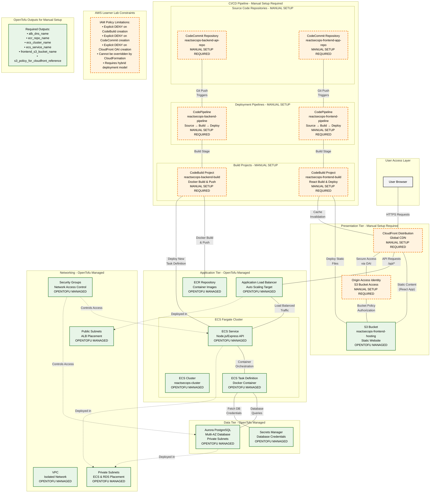

<p align="center">
  
  
  
  
  
  
</p>

# React-Sec-Ops: A Secure 3-Tier Application on AWS

This repository contains the code and infrastructure definitions for a full-stack, 3-tier web application deployed on AWS. The project is designed to demonstrate a modern, secure, and automated approach to cloud application deployment.

## Important Limitation: AWS Learner Lab Environment

The original goal of this project was **100% automated deployment** using OpenTofu. However, through iterative testing, we have conclusively determined that the IAM policies governing the **AWS Learner Lab `LabRole`** include an **explicit `Deny`** on programmatic creation of certain AWS resources, including AWS CodeBuild, CodeCommit, and CloudFront OAI.

This `Deny` policy cannot be overridden, even when using a trusted service like CloudFormation. Therefore, a fully automated deployment is **not possible** within this specific lab environment.

This repository now reflects the necessary **hybrid deployment model**:

1.  **Automated (IaC):** Core infrastructure (VPC, Networking, ECS, RDS, ECR) is deployed via OpenTofu.
2.  **Manual:** CI/CD components (CodePipeline, CodeBuild, etc.) and the CloudFront distribution must be configured manually via the AWS Management Console.

This outcome is a valuable demonstration of diagnosing and adapting to the real-world constraints of managed enterprise or educational cloud environments.

## Table of Contents

- [Learning Objectives & Key Accomplishments](#learning-objectives--key-accomplishments)
- [Project Overview](#project-overview)
- [Architecture Diagram](#architecture-diagram)
- [Key Technologies](#key-technologies)
- [Prerequisites](#prerequisites)
- [Project Setup and Deployment (Hybrid Model)](#project-setup-and-deployment-hybrid-model)
  - [Part A: Automated Infrastructure Deployment (OpenTofu)](#part-a-automated-infrastructure-deployment-opentofu)
  - [Part B: Manual CI/CD & Frontend Configuration (AWS Console)](#part-b-manual-cicd--frontend-configuration-aws-console)
  - [Part C: Pushing Application Code](#part-c-pushing-application-code)
- [Accessing the Application](#accessing-the-application)
- [Project Structure](#project-structure)
- [Security Measures](#security-measures)
- [Cleaning Up](#cleaning-up)

## Learning Objectives & Key Accomplishments

This project serves as a practical demonstration of several core competencies:

- **Infrastructure as Code (IaC) Mastery:** Utilizing OpenTofu to define and manage a complex set of interdependent AWS resources.
- **Cloud-Native Architecture:** Designing a scalable and secure 3-tier architecture using AWS-managed services.
- **DevSecOps Principles:** Implementing security through network segmentation, least privilege, and secure credential management.
- **Advanced Problem-Solving:** Diagnosing un-overridable IAM policy restrictions and adapting the deployment strategy from a fully automated to a hybrid model, documenting the process and constraints.

## Project Overview

The "React-Sec-Ops" project consists of three distinct tiers:

1.  **Presentation Tier (Frontend):** A React.js application, hosted on S3 and served via CloudFront.
2.  **Application Tier (Backend API):** A containerized Node.js/Express REST API running on AWS Fargate.
3.  **Data Tier (Database):** An Amazon Aurora PostgreSQL database in isolated private subnets.

## Architecture Diagram

This diagram illustrates the intended architecture. The CI/CD and CloudFront components, while shown as automated, must be created manually as per the lab's limitations.



## Key Technologies

- **Frontend:** React.js
- **Backend:** Node.js, Express.js
- **Database:** Amazon Aurora (PostgreSQL Compatible)
- **Containerization:** Docker
- **Infrastructure as Code:** OpenTofu
- **CI/CD:** AWS CodePipeline, AWS CodeBuild, AWS CodeCommit
- **Hosting & Compute:** S3, CloudFront, ECS Fargate
- **Security:** AWS IAM, Secrets Manager, VPC, Security Groups

## Prerequisites

- **Git**
- **AWS CLI** (configured)
- **OpenTofu**
- **Node.js & npm**

## Project Setup and Deployment (Hybrid Model)

### Part A: Automated Infrastructure Deployment (OpenTofu)

This step deploys all the resources that the Learner Lab _allows_ to be created programmatically.

1.  **Clone the Repository**
    ```bash
    git clone <your-repository-url>
    cd react-sec-ops-project
    ```
2.  **Deploy with OpenTofu**
    ```bash
    cd infrastructure
    tofu init
    tofu apply --auto-approve
    ```
3.  **Collect Outputs:** After the apply completes, OpenTofu will have created the core infrastructure. Collect the following output values, which are needed for the manual steps:
    ```bash
    tofu output
    ```
    Save the values for:
    - `alb_dns_name`
    - `ecr_repo_name`
    - `ecs_cluster_name`
    - `ecs_service_name`
    - `frontend_s3_bucket_name`
    - `s3_policy_for_cloudfront_reference` (This is a JSON policy string)

### Part B: Manual CI/CD & Frontend Configuration (AWS Console)

Now, log in to the AWS Console and create the restricted resources.

1.  **Create CodeCommit Repositories:**

    - Navigate to **CodeCommit**.
    - Create two repositories with the exact names: `reactsecops-backend-api-repo` and `reactsecops-frontend-app-repo`.

2.  **Create CloudFront OAI & Apply S3 Policy:**

    - Navigate to **CloudFront** > **Origin access** > **Origin access identities (legacy)**.
    - Click **Create origin access identity**.
    - Once created, click its ID and copy the **S3 canonical user ID**.
    - Navigate to **S3** and find your `reactsecops-frontend-hosting-...` bucket.
    - Go to **Permissions** > **Bucket policy** and click **Edit**.
    - Paste the JSON policy you got from the `s3_policy_for_cloudfront_reference` OpenTofu output.
    - **Replace** the placeholder string `"REPLACE_WITH_OAI_CANONICAL_USER_ID"` with the actual canonical user ID you just copied.
    - Save the policy.

3.  **Create CloudFront Distribution:**

    - Navigate to **CloudFront** > **Create distribution**.
    - **Origin domain:** Select your `reactsecops-frontend-hosting-...` S3 bucket.
    - **S3 bucket access:** Choose **Yes, use OAI** and select the OAI you just created.
    - **Viewer protocol policy:** **Redirect HTTP to HTTPS**.
    - Create the distribution. It will take several minutes to deploy.

4.  **Create CI/CD Pipelines:**
    - Navigate to **CodePipeline** > **Create pipeline**.
    - **Backend Pipeline (`reactsecops-backend-pipeline`):**
      - **Source:** `AWS CodeCommit`, `reactsecops-backend-api-repo`, `main` branch.
      - **Build:** `AWS CodeBuild`. Click **Create project**. In the new window:
        - **Project name:** `reactsecops-backend-build`.
        - **Environment:** Amazon Linux 2, Standard image, check the **Privileged** box.
        - **Service role:** Use existing service role > `LabRole`.
        - **Buildspec:** Use a buildspec file.
        - **Environment Variables (Plaintext):** Add `IMAGE_REPO_NAME` with the value from your `ecr_repo_name` output.
      - **Deploy:** `Amazon ECS`. Choose your `ecs_cluster_name` and `ecs_service_name` from the outputs.
    - **Frontend Pipeline (`reactsecops-frontend-pipeline`):**
      - **Source:** `AWS CodeCommit`, `reactsecops-frontend-app-repo`, `main` branch.
      - **Build:** `AWS CodeBuild`. Click **Create project**.
        - **Project name:** `reactsecops-frontend-build`.
        - **Environment:** Amazon Linux 2, Standard image.
        - **Service role:** Use existing service role > `LabRole`.
        - **Buildspec:** Use a buildspec file.
        - **Environment Variables (Plaintext):** Add `S3_BUCKET_NAME` (from `frontend_s3_bucket_name` output) and `CLOUDFRONT_DISTRIBUTION_ID` (from your manually created distribution).

### Part C: Pushing Application Code

1.  **Configure Frontend:**

    - Open `frontend-app/src/App.js`.
    - Replace the `API_ENDPOINT` placeholder with your `alb_dns_name` output.

2.  **Push Backend Code:**

    - Navigate to `backend-api/`, initialize git, and add the CodeCommit repo as the remote.
    - `git remote add origin <your-backend-repo-url>`
    - `git push -u origin main`

3.  **Push Frontend Code:**
    - Navigate to `frontend-app/`, initialize git, and add the CodeCommit repo as the remote.
    - `git remote add origin <your-frontend-repo-url>`
    - `git push -u origin main`

Pushing the code will trigger the pipelines you created manually.

## Accessing the Application

Once the pipelines complete, find your **Distribution domain name** in the CloudFront console and open it in your browser.

## Project Structure

(This section remains as-is)
...

## Security Measures

(This section remains as-is)
...

## Cleaning Up

To avoid ongoing AWS charges, you must destroy both the automated and manual resources.

1.  **Manual Destruction:**
    - Go to the AWS Console and delete the two **CodePipelines**.
    - Delete the two **CodeBuild projects**.
    - Delete the **CloudFront distribution**.
    - Delete the two **CodeCommit repositories**.
2.  **Automated Destruction:**
    - Navigate to the `infrastructure` directory.
    - Run `tofu destroy --auto-approve`.
